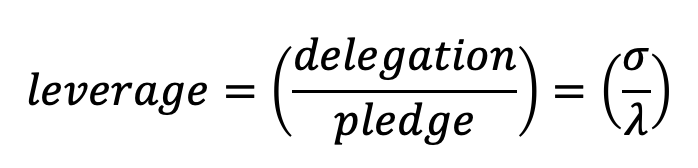

# On CIP-50 Leverage-based Pool Ranking System

The following are notes working from first principles to derive the recommended [CIP-50](https://github.com/michael-liesenfelt/CIPs/blob/CIP-Liesenfelt-Shelleys_Voltaire_decentralization_update/CIP-Liesenfelt-Shelleys_Voltaire_decentralization_update/README.md) leverage-based stake pool ranking equation and methodology.  The final results will be recommended to CIP-50.  Notes are based on thoughts between Michael Liesenfelt and Christophe Garant.

Author of CIP-50: Michael Liensenfelt | [github](https://github.com/michael-liesenfelt) | [twitter](https://twitter.com/DrLiesenfelt)

Supporting Work: Christophe Garant | [github](https://github.com/ccgarant) | [twitter](https://twitter.com/TheStophe)

Date: July 2022

# On Proper Stake Pool Ranking

To complete the CIP-50 Liesenfelt Fair Reward Equation total picture game theory, it was noted thru community comments that the stake pool ranking system should be taken into [consideration](https://github.com/cardano-foundation/CIPs/pull/242#issuecomment-1120710769).  It was a valid point.

Therefore, the following is a walk thru in pursuit of a fair and simple stake pool ranking equation from a decentralization, leverage-based approach.  Stake pools will be referred herein as "pools" for short.

## Principles and Assumptions

The first questions to ask are, what matters? Why? Who is the beneficiary? Good for who? What should be included? Excluded?

The following are the key principles and assumptions for pool ranking:
1. **Decentralization** is the first priority.
2. **Less leverage** is more desirable.
1. Pool Ranking shall be **independent and agnostic to the number of pools**.
1. Pool Ranking shall be **independent of pool yield** because that would automatically knock out smaller pools, early pools, or less filled pools.
1. Pool Ranking shall have **no pool size bias**. Big pools are treated the same as small pools.
1. **Performance** matters for delegators. 

## Key Variables, Parameters, and Definitions

The following are the key variables and parameters for pool ranking per epoch:
- **performance** : number of assigned blocks minted vs dropped
- **leverage** : pool_size / pledge
- **pledge** : pool "down payment"
- **L** : pledge leverage factor parameter
- **pool size** : pledge * leverage factor L
- **fee** : pool flat fee from earned rewards (first cut for SPOs)
- **margin** : pool percent fee from earned rewards, left over from the fee (second cut for SPOs)
- **k-parameter, k** : decentralization parameter, number of desired pools, sets max "soft-cap" on pool

## Ranking Factors

Assume you start with all pools ranking the same.  How do you "up-rank" and "down-rank" pools based on these principles?

### Performance Factor
If all the pools are ranked the same to start, you have to down-rank pools that miss assigned blocks to mint.  At the beginning of every epoch, pools are assigned blocks to mint based on their total stake and a luck factor.

**Conclusion: performance definitely matters.**

### Yield Factor
In the current reward equation, pool yield is highest for only high pledge or almost fully saturated pools.  That is, only pools "filled" or "almost filled" (read 90-100% saturated) will have the highest yield.

However, the current "pool size", or saturation, is __*fixed*__ at about 68 million Ada at k=500 (July 2022). It is __*not*__ relative to pledge.

The pool size should not drive ranking because that would put small pools and new comers at a perpetual disadvantage.  It would incentivize private institutions or centralized crowd funding to amount 68M Ada first, rather than start a small pool first and work for delegation.  Small pools will surely die, and put decentralization at a disadvantage.

In the new reward equation proposed in CIP-50, pool size is determined by the pledge times the pledge leverage factor $L$.  Reward yield is relative to the minimum of either the pledge down payment $\lambda$ times $L$ leverage factor, total stake delegation $\sigma$, or pool size $1/k$.

In the newly proposed reward equation, yes only fully saturated pools will have the highest yield still, __*but*__ that upper pool size limit is relative to pledge (i.e. the upper limit is no longer fixed at a very high amount), making it much more fair.

Also, in the new reward equation, if a pool is filled or over-filled (over saturated), then the SPO can put down more pledge to increase the pool size (increase the saturation upper limit), and thus increase their reward size and eventually maximize yield. (Note: This mechanism in theory will also incentivize pool "groups" or multi-pool operators to just run a single big pool and keep extending their pool size upper limit for more rewards.)

Therefore, yield is a fallout of other of pledge, leverage, external delegation and saturation.  If yeild was purely a metric, only the large full pools would survive, and new early pools would be at a disadvantage, hurting decentralization and biasing new delegators.

**Conclusion: No yield ranking bias** 

So if yeild is not a metric, how to you down-rank the pools as they become more saturated, and at what threshold?

### Leverage Factor
Leverage is a harsh parameter, but necessary.

For example, should one be able to put down $100 and buy a $68,000,000 dollar house? That's a 0.00015% down payment leverage, or 1:680,000 ratio.  That doesn't seem quite right at all.  But that's possible with the current stake pool incentive scheme.

Should pools be up-ranked for higher leverage? Probably not.

That doesn't seem right.  Pools should probably be down-ranked for larger leverage, and rewarded for lower leverage (just like buying a house and the loan rate).

The pool "pledge leverage factor" or $L$ can be defined as the pool size divided by pledge. The relationship is:

Where:

 

So far, **less leverage, better ranking**

So how do you define pool leverage? A simple definition is your staking delegation divided by pledge.  With a fixed delegation, less pledge is more leverage, and more pledge is less leverage.

But for a pool just getting started with low pledge and gains delegation popularity quickly, is it fair to tank the pool's ranking?  Gaining delegation fast should be encouraged, giving the pool time to mint blocks, earn Ada rewards, and build more pledge.

### Introducing Egalitarian Leverage

Is blanket high leverage down-ranking necessarily egalitarian?

Perhaps if a pool can't come up with sufficient Ada to climb the ranks thru more pledge growing pool size, either based on geo-political reasons and/or just getting start, it may be more fair to not have a general blanket down-ranking based on high leverage alone. Maybe high leverage should be looked at more closely.

High leverage seems appropriate when growing a pool, but after a certain threshold, seems to be a detriment.  A knock-down factor applied only after your pool passes a certain leverage threshold might be more fair.

If your delegated stake $\sigma$ is less than half of the pledge leverage $\lambda * L$, you should get full credit.  If above 50%, the knock-down factor should apply.  We'll call this **Egalitarian Leverage**.

If pools are down-ranked universally early on, only accounting for high leverage, then all early pool joiners will be at a constant disadvantage to new pools, and before they even gain a strong foot hold of earning blocks.

As the pledge leverage factor $L$ decreases over time, this will put a huge burden on small pools to come up with much more pledge to compete with bigger pools.

**The Egalitarian Pledge Leverage Factor**

A more egalitarian and equal approach is an **Egalitarian Leverage Factor (ELF)** that begins to apply a knock-down factor or down-rank pools only if above 50% of their pledge leverage threshold.  If the pool's leverage is below 50%, they get full credit (no knock-down factor).

The Eqalitarian Pledge Leverage Factor (ELF) reward mechanism will incentivize healthy boot strapping leverage.  But it also enhances growing pledge and thus sybil attack protection.  

Pool ranking incentivises building and applying more pledge to increase your pool size, and thus increase your 50% pledge leverage threshold before the ranking knock-down factor applies.  That is, incerased pledge, increased 50% leverage threshold, increased ranking, increased delegation size, increased rewards, repeat.

**Conclusion: When delegation exceeds 50% of the pledge leverage threshold, ranking decreases.** 

### Fee Factor
A higher fee should down-rank the pool, and instead of a fixed cost fee *__and__* margin fee, they should be simplified into one "fee" variable.  Also, there should be no minimum fee.  

The $fee$ is now from 0 to 100 percent, or (0.00-1.00).

100% pool fee should drop the ranking. 0% pool fees should be the best ranking and a free market choice.

Sybil attack is protected by the new reward equation and pledge amount, so a zero fee is not an issue for security protection.  Zero pledge will yield zero rewards.  A small pledge will have negligible rewards and low ranking from quickly surpassing the pledge leverage 50% threshold (ELF).

**Less fees, better ranking.**

## Final Equation

A 100% ranked pool would have leverage well under limit, would charge low fees, would make all it's blocks.  Therefore the proposed bareminmum final ranking equation is:

Or in more detail:

## The Ranking System
Instead of a ranking system in numerical ascending order (e.g. 1,2,3,...n) such as is in Daedalus, it is proposed to have a equal sized categorical ranking system akin to academic grade scales (e.g. A+, A, A-, B+, B, B-, C+,...F).  This will break up the pools into different performing categories or "buckets" of equal sizing.  There can be many pools with an A+ 100% grade, not just one.  It is then up to the delegator to decide the pool's goods and services in the A+ category or yeild to choose a pool.

At this time, it was decided not to normalize, bell-curve, or use a 6-epoch moving average, because if all the pools are not performing well, etc, they should not by default be A+ when in fact they are B+.  There can be zero A+ pools just as well, however unlikely.

**Table 1: Pool Grade and Ranking System** 

| Grade | Score | Rank |
| --- | --- | --- |
| A+ | 100-97% | 4.0 |
| A   | 96–93%	| 3.9 |
| A− | 92–90%	| 3.7 |
| B+ | 89–87% | 3.3 |
| B | 86–83% |	3.0 |
| B− | 82–80% | 2.7| 
| C+ | 79–77% | 2.3 |
| C | 76–73% | 2.0 |
| C− | 72–70% | 1.7 |
| D+ | 69–67% | 1.3 |
| D | 66–66% | 1.0 |
| D− | 62–60% | 0.7 |
| F | 59-0% | 0.0 |
--- 

This strategy should make it easier for multiple pools to earn 100% A+ scores.  At that point, it's up to human action to decide on the best goods and service the stake pool provides competing on the free market.

To help promote categories, there should be a round up feature for to be determined amount.

**Ranking Categories**:
The following are the _minumum_ relevant ranking categories.  Each category's factor shall also be graded according to Table 1.  
- performance factor
- leverage factor
- fee factor

**Parameters**:
The following are impacting parameters.
- pledge leverage, L

The overall pool score shall be the product of the individual category ranks, as the Ranking Equation defines.

Each individual category or factor in the ranking equation should be broken out individually as well.

| Category | Grade | Score | Rank |
| --- | --- | --- | --- |
| Overall Score | B+ |  | 3.3 |
| Performance | A | 96% |3.9 |
| Leverage | B- | 81% |2.7 |
| Fees | B | 85% | 3.0 |

***************************************
# V2 Discussion
**** **Question Came Up Here** ********

Q: Should the ranking be a product of the factors, or an average?
A product of the factors would have a sharp drop off.
An average is more intuitive.  But is there a better way.
After discussing with Liesenfelt.  An easier solution was proposed.
How about 10/10 scale, with A B C D F grades, but just subtract from 10.
Also, performance cannot be done, because it is not known what pools are
assigned blocks, only the pools themselves know with the Ouroboros upgrade.
It was agreed upon to do something like:

    ranking = 10 - leverage_factor_term - fee_factor_term

Where:
    ranking system = sort(10 - pledge_factor_term - fee_factor_term , order=descending )

    pledge_factor_term = 10 * max{(pool_leverage/L)^A , (pool_stake/saturation_stake)^B}

    fee_factor_term = C * pool_fee_margin

    //current reward scheme only
    //if fee=minFee term drops out
    //if fee>minFee, then term loses relevance just like rewards w/ larger ///stake
    fixed_fee_factor = D * (fee-minFee)/stake  
    
    

    where:
    - A is 2, has range ( ), can be tweaked
    - B is , has range ( ), can be tweaked
    - C is 50, has range (0-100) ish to be harsh, can be tweaked
    - pool_fee_margin is in range (0-100)%
    - pool leverage = delegation/pledge

Scoring:

| Score 10/10 | Grade |
| --- | --- |
| A | 10-9 |
| B | 8-7 |
| C | 6-5 |
| D | 4-3 |
| F | 2-0 |

**ACTION: Going to rev the ranking equation entirely to Rev 2, keep this for documentation**

**************************************

### Transparency
Pools should be able to see their overall rank score and grade for transparently, along with each category.

Pools should be able to see a numerical category ranking to quickly tell where they need improvement, or for the delegator to judge if the down-ranking hit is a concern to them, to make the human action decision themselves.

In addition, wallets in general should transparently define how pools are ranked, each category's ranking, and additional factors to add onto the ranking system.  Wallets should also provide different ranking "filters" if they would prefer say yield over pledge-leverage, but that is beyond this scope.

## A Pool's Life-Cycle
A pool's cyclical life-cycle of obtaining higher rank will follow:
1. Set low fees and establish better ranking, ensure performance is top-notch.
2. Climb the rankings, gain stake and delegators, approach the pledge leverage 50% threshold.
3. Raise fees to accumulate more rewards to grow pledge and raise pool size to avoid levered knock-down factor.
4. Fall in rankings, collect more ada, sustain slow lose of delegators.
5. Raise the pledge, increase pool size, improve the leverage factor in anticipation of the next growth cycle.
6. Lower fees, climb rankings, get back to a good ranking (step #1).
7. Repeat.

## Summary

The following is the bare minimum new reward stake pool ranking system.

That takes into account the following categories

**Ranking Categories**
- performance
- egalitarian leverage
- fees

**Parameters** 
- pledge leverage, L

Further knock-down or delisting factors will be up to the service provider to provide as additional radio switches to implement at the delegators discretion.  It is advised to implement the following additional categories in a weighted factor function [Ref 2,3].

## Additional Considerations

- yield for delegators (Return On Ada (ROA) or Return on Stake (ROS))
- pledge not met
- inactive
- multipool down-factor
- normalized, bell-curved, moving average for ranking?
- AAA, AA, A instead of A+, A, A-?

**Yield**

**Multi pool operator down-ranking?** 
How to determine mathematically a pool "group", or a group of a multi stake pools run by the same operator or entity?  Should these pools be down-ranked?

This is most likely only able to be determined by human judgement, and most likely optionally implemented by the service provided. (e.g. eternl down-ranks multipool operators).  

The community will have to "hivemind" flagging multi pool operators.  This should be open source and subject to rebuttals.

**Pledge not met** 
Warning or down-ranking if pledge not met? Not show the pool at all?

**Weighted equation?** 
Does certain ranking categories carry more weight.  For example, in trade studies, certain criteria carry more weight.

**Delisting**
What should inhibit listing the stake pools?
- If pledge is not met?
- Inactive?

---------------

Ref: 
1. [Suggestions for improvement #19 ccvault github issue tracker](https://github.com/ccwalletio/tracker/issues/19)
2. [Acqnotes, NAS System Engineering Manual, Trade Studies](https://www.acqnotes.com/Attachments/NAS%20SYSTEM%20ENGINEERING%20MANUAL.pdf)
3. [Chapter 4: System Engineering Tools](https://www.eng.auburn.edu/~dbeale/ESMDCourse/Chapter4.htm)

--------------
